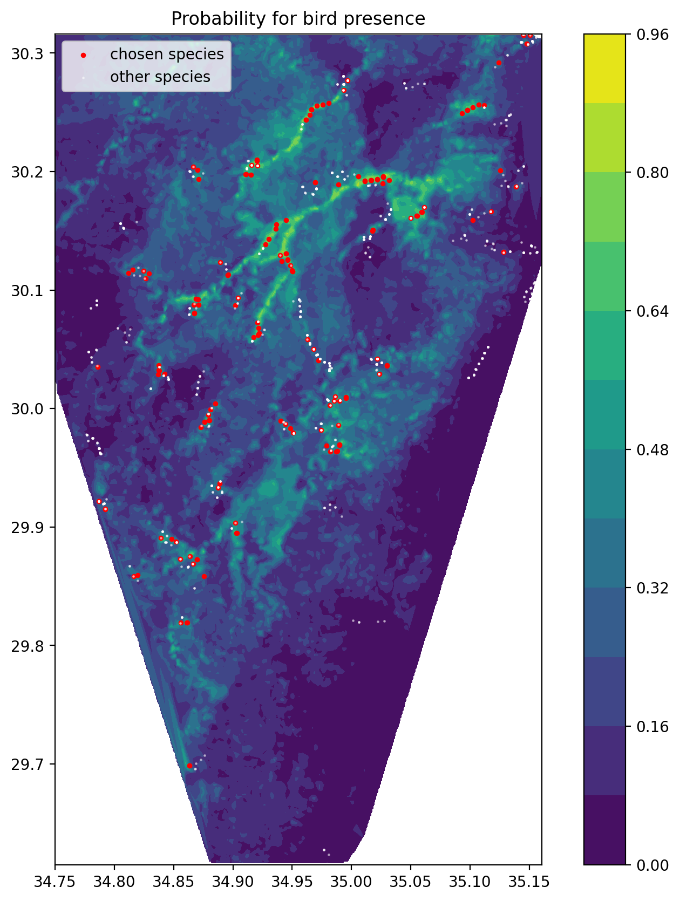

# Species Distribution Models

This project provides a Streamlit application for running species distribution models. The user can select various parameters, including the model type, survey years, conservation ranks, species and the features for the predictive model.
The output is a table and map of the species distribution.


## Usage
Clone the repository, install the dependencies, make a data directory as specified in the section below, and in the project directory run the following command in the terminal:
```
streamlit run src/app.py
```
If there are path issues you might need to run the following command first:
```
export PYTHONPATH="PROJECT_PATH"
```
where PROJECT_PATH is the path to the project directory.

## Dependencies
- **python**: 3.9.13
- **numpy**: 1.23.1
- **streamlit**: ^1.24.1
- **pandas**: 1.5.3
- **catboost**: ^1.2
- **shap**: ^0.42.0
- **scikit-learn**: ^1.3.0
- **geopandas**: ^0.13.2
- **plotnine**: ^0.12.1
- **seaborn**: ^0.12.2
- **elapid**: ^1.0.1

The python version is constrained due to `numba` which seems to have issues with some python versions.
It is recommended to configure the environment with Poetry.

## Data
At least 2 files are needed to run the model:
- **survey.csv**: the survey data file, whose first 7 columns are survey information which do not correspond to features for the predictive model, they are in the following format:

|   | date       | latitude | longitude | survey_name      | species   | conservation_status | reserve_status       |
|---|------------|----------|-----------|------------------|-----------|---------------------|----------------------|
| 0 | 2018-02-16 | 30.15626 | 34.80496  | survey_name2018  | species A | LC                  | proposed_reservation |


The rest of the columns are the features for the predictive model which correspond to this survey sample.
The features can be categorical or numerical. For example:

|   | mean_annual_rainfall | mean_temp_jan | mean_temp_aug | max_temp_june | min_temp_jan |
|---|----------------------|---------------|---------------|---------------|--------------|
| 0 | 52.598541            | 10.856188     | 26.866346     | 39.453480     | 3.031685    |

At least 10 observations from the species in interest are required.

- **df_geo.csv** or **df_geo.geojson**, a csv or geojson file which contain the features used for predictions of the model outside the survey, in the following format:

|   | mean_annual_rainfall | mean_temp_jan | mean_temp_aug | max_temp_june | min_temp_jan | geometry |
|---|----------------------|---------------|---------------|---------------|--------------|----------|
| 0 | 36.517059            | 12.024206     | 29.077404     | 38.498764     | 3.663723    | POLYGON ((35.01329 29.92971, 35.01433 29.92971... |

The none geometry columns should be the same features as in the survey data file, and the geometry column should contain a polygon in the format:
```
POLYGON ((35.01329194886916 29.92970855514185, 35.01432761819664 29.929710051883198, 35.0143259044598 29.930612145604048, 35.01329022579183 29.93061064880832, 35.01329194886916 29.92970855514185))
```

- Optional: **reserve.shp/dbf/cpg/prj/shx** files for plotting reservations on the probability map.


The files should be placed in a data folder which can be specified in the streamlit app, the default path is the data folder in the project directory.


## Models
The following models are currently available:
- Logistic regression
- MaxEnt
- Catboost


## Example output
<p align="center">
  
</p>


            


